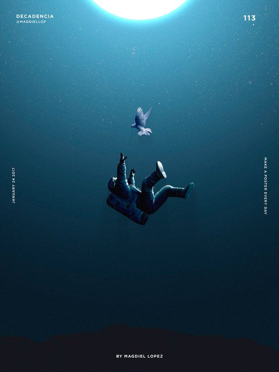
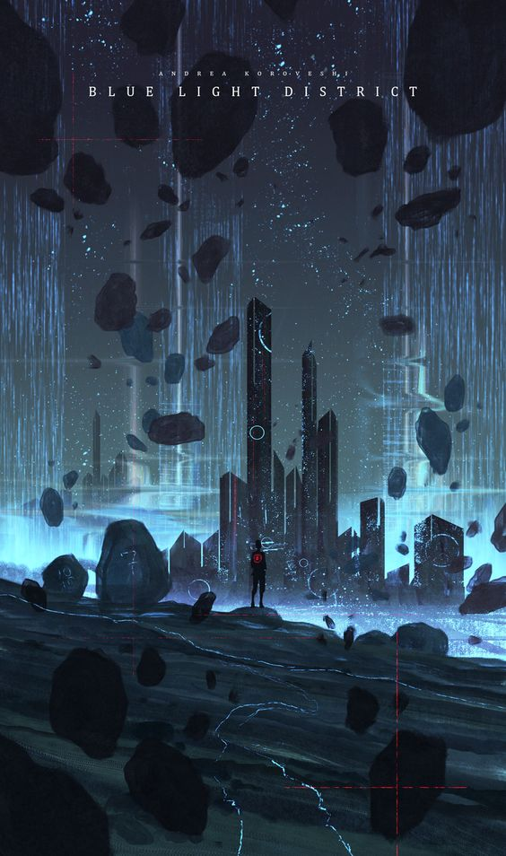
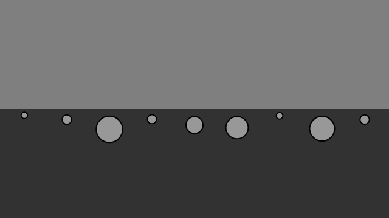

# zhli0255_9103_tut4_quiz8

## Part 1: Imaging Technique Inspiration

I have selected two artworks: A poster named ***Space*** from Magdiel Lopez and a digital artwork named ***Blue Light District*** by Andrea koroveshi. These images evoke a sense of **uncontrolled gravity**, creating a feeling of floating and falling for the viewers. This sensation sparks a fantastical experience of **gravity**, exploring the unknown phenomena one might encounter in space or underwater. It provides a unique visual effect that can captivate the audience's interest and imagination. By implementing the **gravity** effect, I can better express the themes or concepts of the project, offering viewers a distinct visual experience. Additionally, this technique can enhance the project's creativity and appeal.

- An image of the Space

- An image of the Blue Light District

## Part 2: Coding Technique Exploration

To achieve the desired effect of **gravity** manipulation in coding, I would explore using a **simulation of forces** as a coding technique. By applying forces such as gravity and drag to objects (movers), this technique mimics the behavior of objects in gravitational fields or fluid environments. It contributes to creating a realistic simulation where objects float, fall, and interact dynamically based on their mass and the environment they are in.  This involves creating attributes like **mass, position, velocity, and acceleration** for objects and **applying gravitational and drag forces** to each mover. Overall, this technique facilitates the creation of dynamic and immersive simulations.

- An image of the Forces example 1

[Gravity Ball example link](https://p5js.org/examples/simulate-forces.html)

- An image of the Forces example 2

[Gravity Snow example link](https://editor.p5js.org/codingtrain/sketches/UMUPBVuH5)